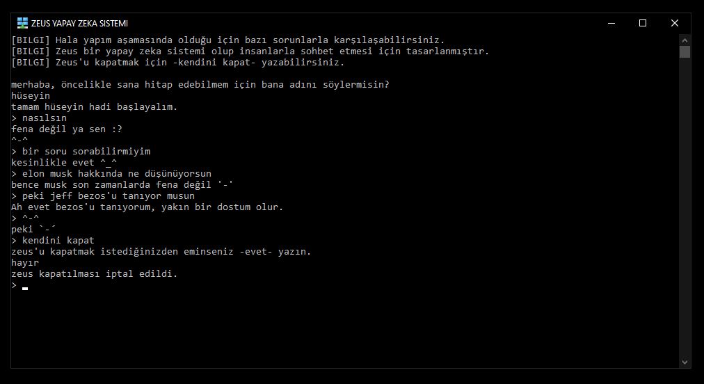

# Welcome to Me

Hi! I'm Huseyin. 17-year-old **full-stack web developer**, especially Cascading Style Sheets. Currently a **high school** student. Below is some information **about me** and below that some of my **repos**, enjoy!

 

## Education

Yes, I am currently an **11th grade student** at Farabi Anatolian High School. At the end of high school, I am thinking of studying **software engineering**.

I will put here my **year-end grades** that I have received so far. (these grades are evaluated out of 100)

> **Grade 4:** 96,8486

> **Grade 5:** 97,0634

> **Grade 6:** 95,5524

> **Grade 7:** 96,4476

> **Grade 8:** 100
 
> **Grade 9:** 97,9345

> **Grade 10:** 99,5858

 

## Projects

I have about 10 or so websites, but of course **these are amateur**, but I also have a github organization called [**Future**](https://github.com/thefuture-org/), and I also contribute on [**Hack Club**](https://github.com/hackclub).

I have an amateur **artificial intelligence** made with **python** consisting of about **2000 lines** called **"zeus"**.

And you can find my personal website [**here**](https://huseyincinar.netlify.app).

> **Note:** I can't devote much time to my projects because my classes are very busy at the moment, so forgive me if you find a mistake.

 

## Other

Yes, this is the part that makes up **"me"**.

I play **table tennis** at an intermediate level as a sport.

I also love watching **movies** and reading **books**.

My favorite drink is **turkish coffee** my favorite food is **baked beans**.

My favorite color is **blue** and I am sincere in everyday life.

> And a few things too long to write here.
    

  
<code><i>Discord Profile</i></code>

 <picture>
    <source alt="discord_profile" media="(prefers-color-scheme: dark)" srcset="https://lanyard-profile-readme.vercel.app/api/782246367204605953?theme=dark&animated=true&hideDiscrim=false&borderRadius=10px&idleMessage=I'm+probably+studying.">
    
  </picture>
 

 

  
  

  
<code><i>GitHub Statistics</i></code>

  
  <picture>
    <source alt="github_stats" media="(prefers-color-scheme: dark)" srcset="https://github-readme-stats.vercel.app/api?username=Huseyin-Cinar&show_icons=true&count_private=true&theme=react&bg_color=0D1117&hide_border=true&custom_title=Huseyin+Cinar's+Github+Stats">
    
  </picture>
  
  <picture>
    <source alt="github_streak_stats" media="(prefers-color-scheme: dark)" srcset="https://github-readme-streak-stats.herokuapp.com/?user=Huseyin-Cinar&theme=react&background=0D1117&count_private=true&hide_border=true">
    
  </picture>
  
  <picture>
    <source alt="github_stats" media="(prefers-color-scheme: dark)" srcset="https://github-readme-stats.vercel.app/api/top-langs/?username=Huseyin-Cinar&layout=compact&theme=react&count_private=true&hide_border=true&bg_color=0D1117">
    
  </picture>
  

  

  
<code><i>Interests</i></code>
 
  

    | <code></code> | <code></code> | <code></code> | <code></code> | <code></code> |
      
   | <code></code> | <code></code> | <code></code> | <code></code> | <code></code> |
      
   | <code></code> | <code></code> | <code></code> | <code></code> | <code></code> |
        
  

